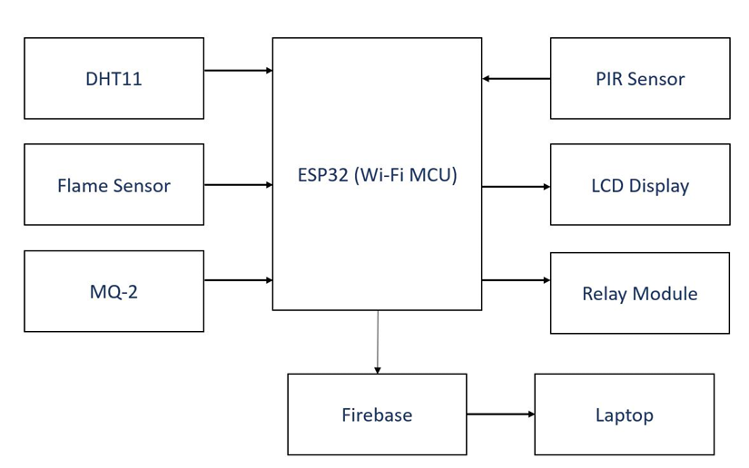

# 🌲 IoT-Based Forest Fire Detector

A smart IoT-based embedded system designed to detect forest fires early using an **ESP32 microcontroller** and multiple sensors (Temperature, Flame, PIR, Gas). The system continuously monitors environmental parameters and updates real-time data to **Firebase**, while triggering alerts and activating a **relay-based sprinkler** when fire conditions are detected.

---

## 🔍 Problem Statement

Forest fires cause large-scale environmental destruction and loss of biodiversity. Early detection and quick response are critical in minimizing damage. Conventional methods rely on human observation and delayed data collection. This project automates fire detection using IoT to provide **instant alerts and real-time monitoring**.

---

## 💡 Solution Overview

The system uses sensors to continuously monitor **temperature, humidity, smoke, and flame**. If abnormal readings are detected, it:
- Sends real-time data to **Firebase Realtime Database**
- Displays alerts on an **I2C LCD**
- Activates a **relay module** connected to a sprinkler (indicator)
- Provides **remote monitoring** capability via IoT

---

## ⚙️ Components Used

 **ESP32** - Central microcontroller with Wi-Fi 
 **DHT11** - Measures temperature and humidity 
 **MQ-2 Sensor** - Detects smoke or flammable gases 
 **Flame Sensor** - Detects open flames or light intensity 
 **PIR Sensor** - Detects human/animal movement 
 **Relay Module** - Controls sprinkler activation 
 **I2C LCD** - Displays sensor readings and alerts 
 **Firebase** - Cloud platform for real-time data logging 

---

## 🧠 Working Principle

1. All sensors collect environmental data continuously.  
2. The ESP32 processes the values and uploads them to Firebase.  
3. If temperature, gas, or flame values cross the safe threshold, the system:  
   - Displays a **“FIRE DETECTED”** alert on the LCD.  
   - Activates the **relay module** to turn on the sprinkler.  
   - Sends data to Firebase for cloud monitoring.

---

## 🧰 Tools & Technologies

- **Hardware:** ESP32, DHT11, MQ-2, Flame Sensor, PIR Sensor, Relay Module, LCD (I2C)
- **Software:** Arduino IDE
- **Cloud:** Firebase Realtime Database
- **Language:** Embedded C / Arduino C

---

## 📷 Images

### 🔌 Hardware Setup

### 🚨 LCD Display Alert

### ☁️ Firebase Monitoring

### 🧱 Block Diagram

---

## 📄 Project Report

📘 [Click here to view the full project report](report.pdf)

---

## 🚀 Future Improvements

- Integration with **mobile app notifications**
- Adding **AI/ML models** to predict fire risk
- Solar-powered deployment for remote areas
- GSM-based SMS alerts for offline zones

---

## 🧾 Source Code Overview

- `forest_fire_detector.ino` – Main Arduino code for ESP32  
- `config.example.js` – Example config file for Firebase credentials  
- `README.md` – Documentation  
- `report.pdf` – Detailed project report  

---

## 👩‍💻 Team / Author

**Anaswara S K**  
B.Tech in Electronics and Communication Engineering (IoT Minor)  
SCT College of Engineering, Thiruvananthapuram  
📧 Email: [skumaranaswara11042004@gmail.com](mailto:skumaranaswara11042004@gmail.com)

---

## 📜 License

This project is licensed under the **MIT License** – you’re free to use, modify, and distribute it with proper attribution.

---

## 🏷️ GitHub Topics

`iot` `esp32` `firebase` `forest-fire-detection` `embedded-systems` `arduino` `sensors` `environmental-monitoring`

